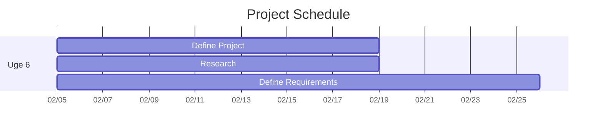

### Gant diagram

```mermaid

gantt

    title Project Schedule

    dateFormat DD-MM-YYYY

    axisFormat %m/%d

 

    section Uge 6

    Define Project : 05-02-2024, 14d

    Research : 05-02-2024, 14d

    Define Requirements : 05-02-2024, 21d

 

```
